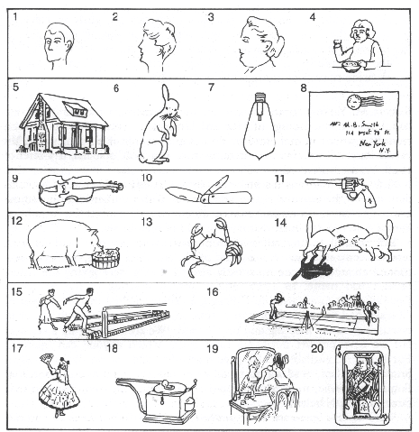

---
format:
  revealjs:
    theme: simple
    transition: none
    center: false
    incremental: false
    embed-resources: true
---

## Meehl's criteria

**Verisimilitude:**

- "Money in the bank": successful and nearly successful risky predictions earn credit for further testing and amendment.
- "Damn strange coincidence": success matters when it would be improbable without the theory.

## Guest's criteria {.smaller}

| Dimension | Description|
|---|---|
| **Metaphysical commitment** | What is the theory? What causal relationships does the theory propose? What does the theory assert? |
| **Discursive survival** | Is the theory accessible and easy to understand? Are members of the theory’s community able to explain the theory? |
| **Empirical interface** | How observations relate to, and affect, theory and vice versa. |
| **Minimising harm** | What harms have resulted or could result from the use of the theory? |

<!-- **Verisimilitude:** -->

<!-- - "Money in the bank": successful and nearly successful risky predictions earn credit for further testing and amendment. -->
<!-- - "Damn strange coincidence": success matters when it would be improbable without the theory. -->

## Q1

Pick two dimensions, tell us why (not limited to these, but let's start with):

* **Verisimilitude**
* **Metaphysical commitment**
* **Discursive survival**
* **Empirical interface**
* **Minimising harm**

## Q2 {.smaller}

Consider these two excerpts from Guest, 2024:

> great man theorising is ‘an important obstacle to building theory’ (van Rooij, 2021; also see van Rooij, 2022). Great man theorists fabricate and/or obscure anecdotal and historical evidence to ensure the credit is directed at the target prestigious figure.

> there are theories which attempt violently or minimally without the consent of their proponents, to unify competing or alternative accounts all under their own banner [...] these violent attempts of unification often involve draining meaning from the concepts of alternative theories and replacing them with their own or discarding them completely.

Is there tension between these two excerpts?

Should theorists have ownership over their ideas?

Is it violent to unify, or otherwise build upon, existing ideas?

## Q3

Consider this excerpt from Guest, 2024:

> [Discursive survival:] do interested non-bad actors understand the theory as presented by its proponents?

Actor ethos  | Bad | Good
------------|-----|-------
Understood  | ?   | DQ
Not underst.| ?   | No DQ      

How does actors' ethos relate to discursive survival (DQ)?

## Q4 The Gender Pay Gap

Let's consider Lakatoshian Defense with regard to a specific phenomenon: the Gender Pay Gap

<https://www.cato.org/commentary/gender-pay-gap-myth-wont-go-away> 

<https://eufactcheck.eu/factcheck/mostly-false-there-is-no-gender-pay-gap/> 

# When to abandon a bad theory?

Trigger warning: We will be reflecting on and discussing issues pertaining to racism, stereotyping, and institutional bias that many will consider offensive

## Eugenics / Scientific Racism

**Racism** is the belief that groups of humans possess different behavioral traits corresponding to inherited attributes and can be divided based on the superiority of one race or ethnicity over another

**Eugenics**: aiming to improve the genetic quality of a human population by inhibiting the fertility of those considered inferior, or promoting that of those considered superior.

**Important disclaimer:**

* In terms of biology, [“races”] aren’t different enough to have as separate groups. [...] the human species doesn’t have much genetic variation. We are too alike to split into groups.

## Eugenicist statisticians

* Francis Galton: First to apply statistics to study of human differences and intelligence. Inventor of correlation and survey methodology
* Karl Pearson: Correlation coefficient, p-value, Chi-squared test, principal components analysis etc.
* Charles Spearman: Rank correlation, factor analysis

Main focus area was human intelligence, as a potential "justification" for white supremacy

## The racist roots of intelligence tests {.smaller}

Robert Yerkes (1917):

* US army tested 1.750.000 men
* White Americans scored highest, followed by white immigrants, followed by African Americans
* 89 percent of African Americans were classified as "morons" (quote from the paper, preserved to emphasize how egregious this is)

Conclusion:

> [These results] are now definitely known, to measure native intellectual ability. They are to some extent influenced by educational acquirement, but in the main the soldier's inborn intelligence [...] determines his mental rating

See Rury, 1988 <https://doi.org/10.2307/2295276> for critique

## Exerpt from the intelligence test

<!-- ## Example: Racism and Intelligence -->

<!--  -->

## Critique of content validity

* All items have a strong cultural component
    + I don't even know what games these people are playing, or what component of the gun or record player (?) is missing
* During the height of segregation
* Widespread institutional racism excluded black folk from white institutions, neighborhoods, cultural activities, and education
* This would limit their exposure to white cultural background knowledge necessary for the test

## Now: Nathan Cofnas

<https://emeraldbook.org/news/aug-0626-2/>

## Q5

Given these harmful origins, how should we relate to:

* "scientific racism"?
    + What of scholars who claim "intellectual freedom" to continue investigating it?
* intelligence research in general?
* statistical methodology?

## Q6

Share your experience - how have you seen the strategy of Lakatosian Defense enacted in your studies?

## Q7

What distinguishes evidence for a theory from evidence that an effect exists?

# Meehl 1990

## Appraising and amending theories

> When is a theory worth defending rather than abandoning?

- Paul E. Meehl (1990).

## From truth to truthlikeness

- Literal falsity does not automatically require abandoning a theory.
- Verisimilitude means truthlikeness: an imperfect theory may still merit improvement.
- "Does the theory have sufficient verisimilitude to warrant our continuing to test it and amend it?"
- A justification that retain the demand for risky tests without treating every miss as grounds for abandonment.

## Relationship between theory and test

- Predictions depend on the substantive theory, auxiliary theories, instruments, "all else equal" (Cp), and realized conditions.
- A falsifying observation rejects **this conjunction**, not the substantive theory alone.
- Logic identifies a failure somewhere in the package, not which component failed.
- Choosing what to revise is a matter of scientific strategy.

## Progressive or degenerating repair?

- A Lakatosian defense protects the theoretical core while reconsidering its protective belt.
- Progressive changes add testable content, succeed empirically, and follow the theory's guiding ideas.
- Degenerating programs accumulate ad hoc repairs without comparable empirical gains.
- There is no fixed cutoff for abandonment, but continued pursuit must transparently acknowledge a poor public record.

## Two principles warrant defense

- "Money in the bank": successful and nearly successful risky predictions earn credit for further testing and amendment.
- "Damn strange coincidence": success matters when it would be improbable without the theory.
- The principles work together: surprising successes build the track record that warrants defense.
- Corroboration supports a theory; it does not deductively prove it.

## Two uses of significance tests

- Weak use: test departure from a zero-effect null; significance is taken as support for the theory (even if the null is not theoretically relevant).
- Strong use: test departure from the theory's predicted value; a significant mismatch challenges the prediction.
- Greater precision makes strong tests more dangerous, but false nulls easier to reject in weak tests.
- Rejecting a statistical null does not establish the substantive theory.

## The crud factor

- "Everything is correlated with everything, more or less."
- As power increases, all tests become significant, further reducing the usefulness of NHST
- Meehl's concern is background systematic relationships, not merely random measurement noise.
- A real association may do little to distinguish one theory from its rivals.
- Randomly pairing theories and variables can still produce apparent "substantiations."

## Judge risk and accuracy together

- Spielraum: a reasonable antecedent range of possible values.
- Intolerance: how narrow is the prediction relative to that range?
- Accuracy: how close is the result to the prediction, relative to the Spielraum?
- A close miss on a risky prediction can still corroborate a theory, despite a statistically detectable discrepancy.

## Not a blanket rejection of statistics

- Significance tests can help evaluate practical efficacy.
- They are more informative when the statistical alternative nearly is the substantive claim.
- Statistical considerations can also guide discovery.
- For theory appraisal, a larger effect is not automatically better: the target is the predicted effect.
- Replicability matters more than significance alone.
    + If everyone can reproduce the effect (regardless of its significance) - is significance even relevant?

## Related thoughts

- Specify predictions and plausible ranges before observing results.
- Compare rival theories, not only a theory against a zero-effect null.
- Preserve the original prediction, document amendments, and test their new consequences on fresh data.
- What finding would make us stop protecting the core?

## Earn the right to be wrong

- A record of successful and nearly successful risky predictions warrants defense and amendment.
- Judge both intolerance and accuracy against a reasonable antecedent range.
- "It is perfectly rational to play a risky game: what is irrational is to deceive oneself about the risk." - Lakatos (1971), quoted by Meehl (1990), p. 115.

# Guest (2024): an ontology of criteria for evaluating theory.

## Evaluating theories beyond fit

- Four categories: metaphysical commitment, discursive survival, empirical interface, and minimising harm.
- How can we make decisions about theories explicit and open to scrutiny?
- Based on the supplied annotations; page references follow those notes.

## Why a calculus? Why an ontology?

- Scientists already choose which theories to pursue, criticise, rank, or abandon.
- A metatheoretical calculus makes the criteria for that decision explicit and formal.
- An ontology groups properties that can count as theoretical virtues or vices.
- Define and scope "theory," then state which virtues and vices matter.

## Metaphysical commitment

- Identify what the theory assumes, asserts, or treats as essential.
- Distinguish these commitments from what is currently under investigation.
- Clarify the theory's claims, proposed causal relationships, and disciplinary setting.
- Ask what counts as use or misuse of the theory.

## Unification is not always a virtue

- Unification can absorb rival accounts without their proponents' consent.
- Concepts may lose meaning when replaced or discarded by the dominant account.
- Such "amoeba-like anti-pluralist" theories can damage their fields.
- The concern is imposed unification where it is neither needed nor requested.

## Discursive survival

- Can interested good-faith readers understand and scrutinise the theory?
- Make concepts transparent and use labels consistently, including for relevant outsiders.
- Being intelligible only to proponents can signal theoretical weakness.
- Example: "neuron" must not blur an artificial model unit with a biological cell.

## Empirical interface

- Explain how theory informs observations and how observations can revise theory.
- Formal models can mediate between core claims and interpreted findings.
- Specify relevant methods, evidence, model-fit criteria, and statistical interpretation.
- Apparent untestability can reflect a missing or unclear interface.
- A theory need not yet generate hypotheses to have virtues, but should aim toward an empirical interface.

## Minimising harm

- Treat historical and ongoing harms as part of theory appraisal.
- Examine harms arising from a theory's design, development, and use.
- Environmental costs of large AI models, exploitation, and academic marginalisation.
- Like vehicle safety, harmful outcomes can reflect design as well as users' actions.

## Credit, exclusion, and genealogy

- "Great man theorising" concentrates credit while obscuring collective contributions.
- Exclusion erases people and ways of knowing; Guest links it to coloniality, capitalism, and patriarchy.
- These dynamics can reinforce one another and constrain theoretical development.
- Genealogy: ask whether harmful ideas appear in the theory's ancestry and still matter today.

## What follows from finding a vice?

- A vice may justify rejecting a theory in its current state without tallying its other virtues.
- This is a heuristic option, not an automatic requirement to abandon the theory.
- Researchers may pursue a better theory or work to repair the identified vice.
- Vicious uses or embedding in a vicious field count as properties of the theory itself.

## Related thoughts

- Who chooses the virtues and vices, and whose judgments are missing?
- Which vices warrant rejection, and which call for revision?
- How can empirical, discursive, and ethical appraisal guide the same revision?
- What would count as evidence that a vice has been repaired?

## Beyond goodness-of-fit

- Data fit is one criterion, not a complete appraisal of a theory.
- Counting only fit is like judging a home only by its number of bricks.
- A pile of bricks can then outrank a usable dwelling.
- Make the criteria behind theoretical judgments explicit.

