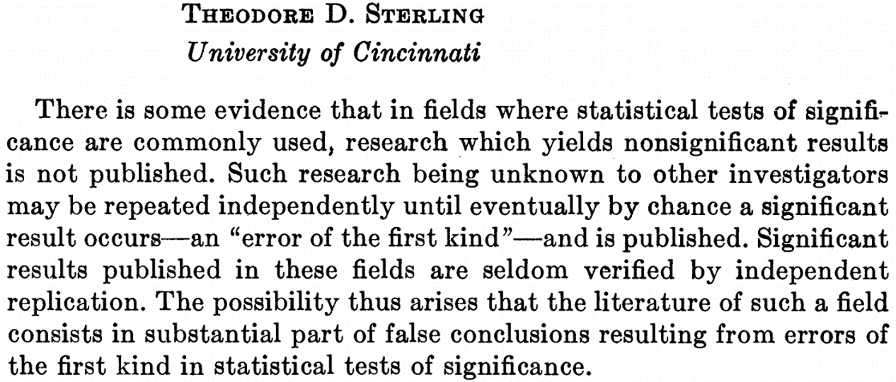
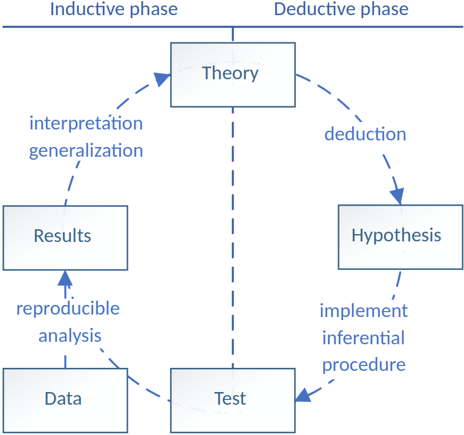
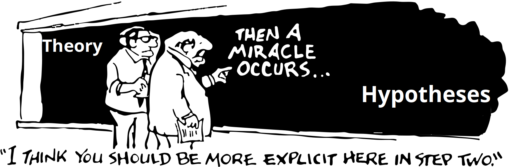

## Two assumptions

<!-- If you're in this room, I'm going to make two assumptions about you: -->

* you are curious
* you are (at least a little ambitious)

<!-- That's exactly how I started -->

## My training...

<!-- In my masters, I was trained in the scientific way to satisfy my curiosity -->

1. collect data
2. conduct statistical tests
3. look for interesting results
    + IF p < .05, write paper
    + ELSE, wash rinse repeat

<!-- The most pertinent example was my master's thesis: I had a theory, that people would be less able to identify suitable dating partners if you put them under stress. I conducted an experiment, tested the hypothesis, and found: no significant result. -->

<!-- I wrote the paper and sent it to my supervisor - he emailed me back on the weekend, saying -->

<!-- "The paper is great, but your results are not significant. I performed some additional analyses, and if you process the data like this, the result is significant. Go ahead and write it up" -->

<!-- I was really impressed. The way he proposed to process the data was something esotheric that I had never considered before. Clearly, I still had a lot to learn -->

<!-- So over time, I became really good at this way of working, manipulating the data and getting significant results. And then, just when I graduated, something terrible happened... -->

## Then, crisis happened

# Pervasive problems in research culture

* Scientific fraud (Levelt, Noort, & Drenth, 2012)
* Questionable research practices (John, Loewenstein, & Prelec, 2012)
* P-hacking / p-ritual (Gigerenzer, 2018)

## Result: the replication crisis

**38% (of 100 psychological effects) replicated in the Open Science Collaboration project (2015)**

> "most psychologists acknowledge that a crisis exists and seem to blame it on poor methodological and statistical practices."

## 70 years of warnings

Sterling, 1959:

## Chapter 2: The deeper crisis {.smaller}

* 89.6% of papers test hypotheses – only 15% cite theory, Kühberger et al., 2014; McPhetres et al., 2019
* Many theories are (strategically) ambiguous, Frankenhuis et al., 2023
* Resistant to falsification (like PFAS), Eronen & Bringmann, 2021; Scheel, Tiokhin, Isager, & Lakens, 2021
* Need for theory construction methods, Meehl, 1978
* The crisis runs much deeper and is ultimately rooted in theory, Oberauer & Lewandowsky, 2019; Muthukrishna & Henrich

## What caused the crisis? {.smaller}

* psychological theories come and go with little cumulative progress, people just lose interest (Meehl, 1978)
    + Behavior change alone has **83 theories** (Michie et al., 2014), these can´t all be true
* Theories [are] like toothbrushes — no self-respecting person wants to use anyone else’s., Mischel, 2008
* Emphasis on newsworthy one-shot studies, not on theoretically founded research programmes, Burghardt & Bodansky, 2021
* Social-scientific theories are too "vague", Meehl, 1978
* Theories should be formalized, Robinaugh et al., 2021; Smaldino

## The ideal situation

Based on De Groot, 1961 (by Van Lissa, 2025)

## This is a real problem

* Theory comes first, before you can even begin to test a hypothesis, Scheel et al., 2021
* Lack of theory impedes cumulative knowledge acquisition (Van Lissa et al., 2025)

## Where we stand

* Since ~2020, rising interest in theory
* Several highly-funded research programmes launched, including "From Patterns to Principles"
    + Tutorial teacher Ward Eiling and guest teacher Rasoul Norouzi work on this project
* Theory Methods Society founded, https://theorymethodssociety.org/ 
    + First conference next week
* Educating the next generation to make a real difference - this is where you come in!

## This course

Three sections:

1. Why theory needs an update?
2. How to construct (better) theories?
3. The cutting edge of theory methodology

## Activities

Time with me

* in-depth discussion of articles

Time with Ward

* Applying hands-on methods to interact with theory
* you then apply these to your final assignment

## Examination

Almost no extra work for the examination if you just prepare for class and make the tutorials

* Each week you make part of the MC exam
* You'll have one scheduled writing assignment
    + you have access to all papers and no other materials/resources
    + you receive a mystery question
    + you write about 1 paragraph
* Paper about a theory you specified (in tutorials and homework)
* Presentation (during last class sessions)

## Let's make our first questions now

Open quiz

## Socratic method

* Discuss an open-ended question or text.
* No discussion leader; respond and ask follow-up questions directly to one another
* Student-owned conversation. The conversation does not flow through the teacher.
* I will pose a strong opening question and then step back
    + You can ask me questions
    + I occasionally moderate or introdce a next question

## Discussion rules {.smaller}

1. Listen respectfully and fully with the intention to understand
2. Assume good intentions
3. Challenge ideas, not people
4. Acknowledge previous ideas and build on them
5. Step up, then step back: speak your mind, then give everyone else a chance to speak
6. When you notice that you are making assumptions, ask a question
7. Take responsibility for your statements: Speak in the first person (I think, I notice), bring the evidence for your claims
8. Focus on what can be learned, not on "winning" the debate
9. If you respond emotionally to the topic of the discussion, express it
10. Pass the microphone to the first person with a hand up to your left (end of the room: start again on other side)

## Q1

Help diagnose the problem: Have you seen evidence of the theory crisis in your studies? Mention your subfield in your answer.

Contrarian position: What is going well?

<!-- Follow-up: How can you identify a “phenomenon” without already having some theory about the world? -->

## Q2

Muthukrishna & Henrich emphasize theory as the framework that makes individual findings scientifically meaningful (the metaphor of findings as bricks and theory as the house), whereas Eronen & Bringmann argue that we first need robust phenomena to constrain the space of possible theories. Where do you stand - would you begin by developing a theory or by establishing phenomena, and why?

## Q3

Suppose someone invents a method that allows you to test empirical findings with perfect accuracy. The replication crisis is now gone. How would this impact the theory crisis?

## Q4

Referring to the theory crisis, Muthukrishna writes: "Compounding the problem, most psychologists are WEIRD (Western educated industrialized rich democratic); their lives and intuitions often differ in dramatic ways from those of people in most societies, undercutting our efforts to accumulate knowledge" -> Does the fact that most psychologists are WEIRD indeed compound the problem?

## Q5

Muthukrishna mentions the example of the "precambrian rabbit": If one would find a rabbit fossil in rock from the precambrian period, before their supposed evolution - that would provide incontrovertible evidence to disprove evolutionary theory. Do such indisputible findings exist for psychological theory too? Can you think of examples?

<!-- ## What about the "measurement crisis"? -->

<!-- * Many psychological constructs are poorly measured, Bringmann, Elmer, & Eronen, 2021; Flake & Fried, 2020 -->
<!-- * This overlaps with theory crisis -->
<!--     + You must define constructs before you can measure them (ontology) -->
<!--     + There are theories of measurement, e.g.: people have introspective access to their internal states; behaviors are indicative of internal states, etc. -->
<!-- * Problems of measurement also affect all quantitative methods -->
<!--     + Regression (including t-test, ANOVA, and other forms of regression) assumes that predictors are measured without error, and that outcomes have normally distributed error -->
<!--     + This is probably not true -->
<!-- * Measurement is not a focus of this course; purview of *psychometrics* -->

## Findings only make sense wrt theory

Newsworthy findings are surprising, but often with respect to lay intuitions

A mature theory would tell us what is truly surprising, e.g., the Precambrian rabbit

Evolutionary theory makes the observation consequential: it tells us what would count as a serious anomaly.

**Ask yourself:** What observations would force us to revise a general theory of human behavior?

## Findings are stones, theories are a house

> "Science is built up of facts, as a house is built of stones; but an accumulation of facts is no more a science than a heap of stones is a house." Henri Poincaré

Methodological and statistical reforms can help ensure **solid stones**.

Theory supplies the **architecture** for building a house of cumulative findings

## Example of stones vs house

**Undergraduates walk slower when reminded of the elderly** (famous priming study)

- What theory of human behavior predicts slower walking?
- What would faster walking imply?
- What would no effect imply?
- To whom should the result generalize?

These questions are not automatically answered, you have to do the theoretical work

## Science as abduction

The scientific process often looks less like clean induction or deduction and more like **abduction**:

**phenomenon -> possible explanations -> best explanation**

The "hypothesis space": the set/space of all possible explanations

Theory helps narrow down this space

## Example: The broken vase

A vase is broken. We observe:

- the window is open, there is wind coming through
- the cat is not in the basket
- a toddler acting suspiciously

We can collect observations, do experiments

Theories about wind force, cat behavior, and toddler's developmental abilities constrain the hypothesis space before data collection.

## Experiments are not the first move

> "Experiments are arguably the last resort after competing theoretical predictions cannot be distinguished with existing evidence..."

An experiment is most informative when competing theories already make distinguishable predictions.

## Definitions for cumulative science

| Term | Definition |
|---|---|
| **Theoretical framework** | Broad body of connected theories |
| **Theory** | General, unifying explanation across a wide array of data |
| **Hypothesis** | Testable, falsifiable prediction that can distinguish theories |
| **Data** | Observations used to test hypotheses |

## Why formal models matter

Formal modelling makes explicit:

- assumptions;
- logical relationships;
- predictions;
- points where a theory can be challenged or modified.

Models are thinking aids; externalize your assumptions instead of keeping them in working memory

## Benefits of theory

- generate clear predictions, including through formal models;
- help prioritize research questions;
- motivate choice of empirical methods;
- integrate evidence across scientific fields;
- move psychology toward a more general theory of human behavior.

## "Surprising" relative to what?

The danger is that an effect seems interesting (and newsworthy) because it is surprising

But surprising relative to what?

> "‘surprising’ should occur with reference to particular hypotheses derived from a broader general theory, not based on folk intuitions and theories derived from one’s own life experience."

Surprise is only productive when a theory told us what to expect.

## Psychology's WEIRD problem

The authors argue that psychologists' own experiences may be an unreliable source of intuitions about humanity because psychologists are disproportionately **WEIRD**: Western, Educated, Industrialized, Rich, and Democratic.

This can distort which phenomena seem natural, surprising, or universal and can impede theory-building about human minds more generally

## Three fundamental difficulties

Eronen and Bringmann, 2021:

1. **Too few robust phenomena** to constrain theories
2. **Weak construct validity** and limited epistemic iteration
3. **Difficulty establishing psychological causes**

## Phenomena constrain theories

Theory testing is **bidirectional**:

* Theory -> predictions about phenomena
* Phenomena -> constrain theory space

A theory must accommodate the relevant robust phenomena, narrowing the space of plausible explanations (Bechtel & Richardson, 1993; Craver & Darden, 2013).

## Darwin: strong constraints from phenomena

Darwin accumulated observations across:

- species distributions
- selective breeding
- the fossil record
- collected specimens

Patterns were **independently detectable and verifiable**, creating strong constraints on evolutionary explanations.

## Psychology often lacks those constraints

Many areas lack a large body of robust phenomena.

Evidence may **underdetermine theory**: several theories can remain compatible with what we observe (Stanford, 2017)

* Important point: evidence ALWAYS underdetermines theory, so this is a weak argument (related to the problem of induction)

## Example: ego depletion

**Original account:** self-control draws on a limited resource (Baumeister et al., 1998, 2000)

A preregistered multilab replication found an overall effect of only **d = 0.04** (Hagger et al., 2016), most CI's included zero

Even if an effect exists, alternative explanations remain possible

* changes in motivation and attention (Inzlicht & Schmeichel, 2012; Inzlicht & Friese, 2019)

## Problem 2: construct validity

Psychology continually introduces constructs and scales (Hagger, 2014)

For a construct to support theory:

- it must be meaningfully embedded in a nomological network
- its measurements must be valid

Validity often receives less attention than reliability

## Reliability and validity

Reliability has convenient quantitative summaries such as Cronbach’s $\alpha$

Validity is harder:

> Does variation in the attribute actually produce variation in the measure?

A review of *JPSP* articles found that most reported **no validity evidence** (Flake et al., 2017)

## Example: major depressive disorder

The MDD construct illustrates the problem:

- people can receive the same diagnosis of MDD even if they share zero symptoms
- commonly used scales to measure MDD have limited content overlap

Do they even capture a single well-defined construct? (De Jonge et al., 2015; Fried, 2017; Fried & Flake, 2018).

## Constructs need epistemic iteration

Scientific concepts should be repeatedly:

* defined, measured, tested, then revised

Natural-science classifications often change as evidence and theory develop.

* E.g., definition of "fish" went from "things with fins that live in water" to a more fine-grained, genetically based classification

Psychological construct validation is less consistently treated as this kind of ongoing process (Flake et al., 2017).

## But iteration is possible

The concept **memory** was initially considered to be a single faculty (Tulving, 2007; Michaelian & Sutton, 2017)

Later work differentiated:

- declarative vs. nondeclarative memory
- episodic vs. semantic memory
- etc.

Even psychological concepts can be iteratibvely refined

## Why bad constructs persist

* **Generative entrenchment:** many theories, measures, and practices depend on a construct
* Changing it would cause all these dependencies to collapse (Wimsatt, 1986, 2007)
    + Like Jenga, nobody wants to be the one to topple the stack
* This creates a feedback loop:
    + Weak constructs -> questionable measurements -> fragile phenomena -> weak constraints on theory

## Problem 3: psychological causation

Good theories specify causal relationships (Craver, 2007; Pearl, 2000; Woodward, 2003).

Interventionist definition of causality:

* X causes Y when intervening on X changes Y while relevant alternatives are held fixed.

Psychological variables are difficult to manipulate cleanly

## "Fat-handed" interventions

Psychological manipulations often change **several things at once** (Eronen, 2020).

Trying to manipulate one state - e.g., ego depletion - may also change:

- motivation
- attention
- anxiety
- frustration

Poorer subsequent performance does not unambiguously point to *depleted self-control* (Friese et al., 2019)

## How to move forward

Prioritize **phenomenon-driven research**:

- discover robust phenomena;
- replicate them across methods and contexts;
- improve construct validity through ongoing iteration;
- build stronger empirical constraints before demanding elaborate theory.

(Borsboom et al., 2021; De Houwer, 2011; Haig, 2013; Trafimow & Earp, 2016)

## Formalization is not enough

Calls for more formal theory are common (Borsboom et al., 2021; Muthukrishna & Henrich, 2019; Oberauer & Lewandowsky, 2019; van Rooij & Baggio, 2021).

But formalization alone does not solve:

1. fragile phenomena;
2. invalid constructs;
3. ambiguous causal relations.

Complex models cannot substitute for a solid conceptual and empirical foundation.

## Takeaway

* There is a theory crisis
* This limits cumulative knowledge acquisition (building a house)
* The theory crisis is not just a formalization problem
* We should promote conditions under which good theories become possible:
    + Establish robust phenomena
    + Develop valid constructs
    + Obtain credible causal evidence

